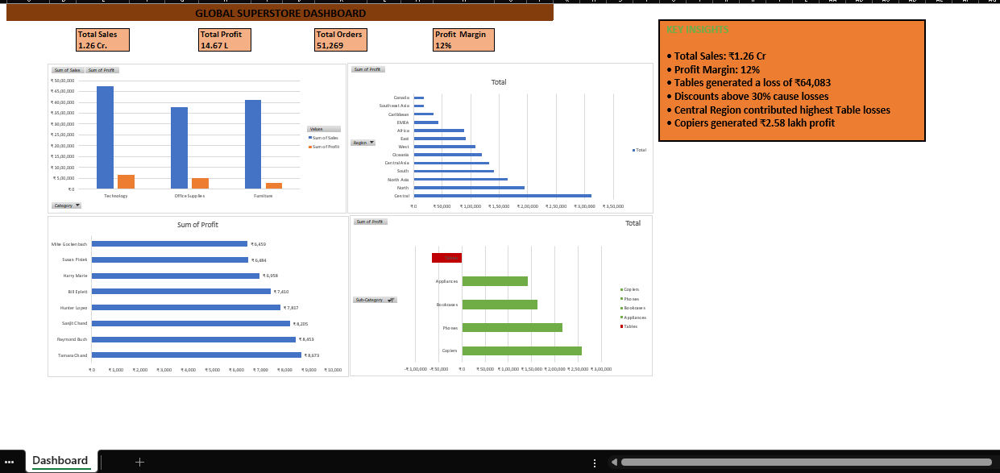

# Global Superstore Retail Analysis Dashboard

## Project Overview
This project analyzes 51,269 retail transactions to identify sales trends, profitability drivers, customer behavior, and regional performance.

## Tools Used
- Microsoft Excel
- Pivot Tables
- Pivot Charts
- Data Cleaning
- Business Analysis
- Dashboard Design

## Key Metrics
- Total Sales: ₹1.26 Cr
- Total Profit: ₹14.67 L
- Total Orders: 51,269
- Profit Margin: 12%

## Key Insights
- Technology generated the highest sales.
- Tables generated a loss of ₹64,083.
- Discounts above 30% caused losses.
- Central region contributed the highest table losses.
- Copiers generated ₹2.58 lakh profit.

## Dashboard Preview

## Skills Demonstrated
- Data Analysis
- Business Analysis
- Data Visualization
- KPI Reporting
- Excel Dashboarding
- Root Cause Analysis
